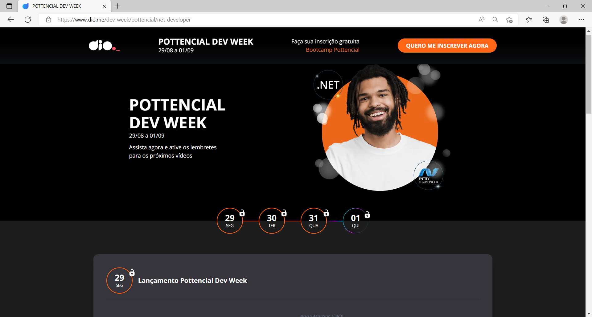
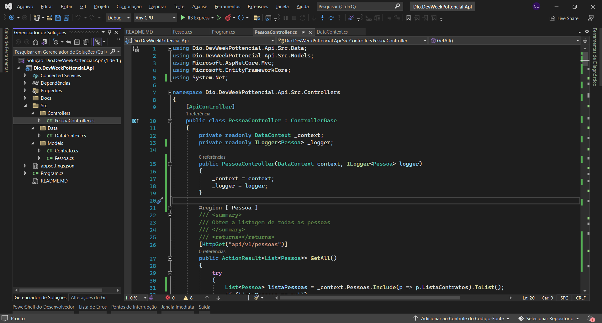
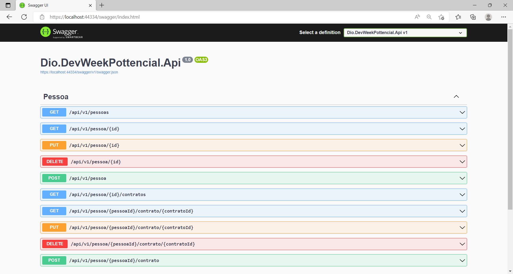
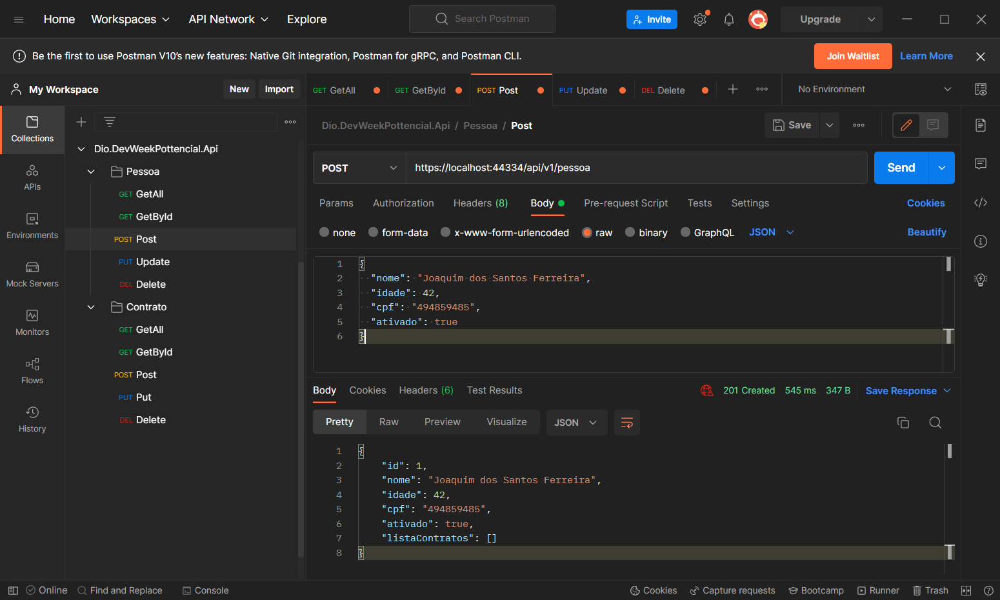
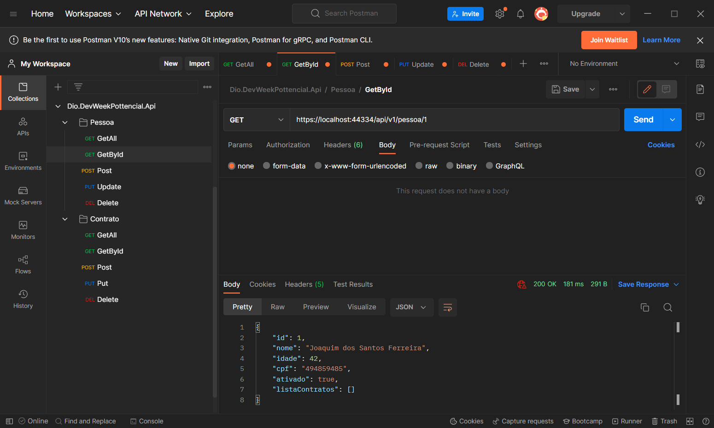
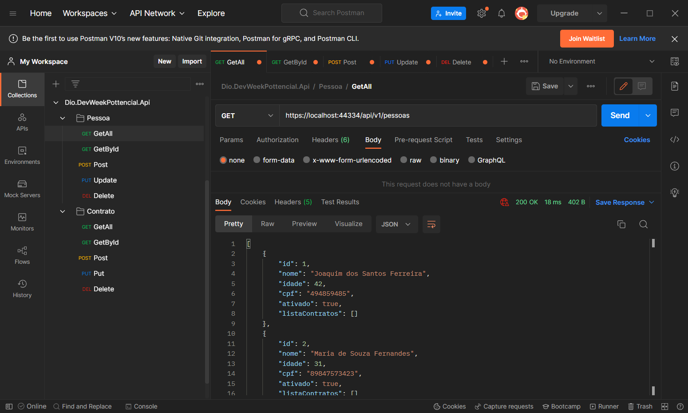
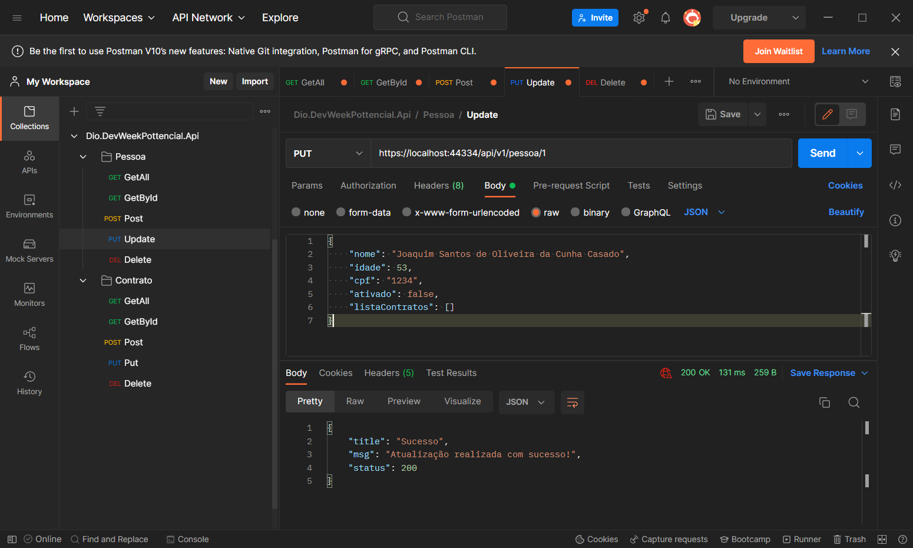

# WebAPI de Gerenciamento de Contratos #

Aplicação desenvolvidada com base no DevWeekPottencial da parceria [DIO] + [Pottencial].

Com a didática excelente do mestre [Felipe Aguiar] e apoio do [Rafael Galvão], criamos uma Web API usando o .NET 6, EntityFramework e BancoInMemory.

Foram 4 dias de muitos aprendizados e mentorias.

Pretendo futuramente aplicar os designs patterns DTO/Data Annotations(para padronizar a entrada de dados do Request), Repositório(para descentralizar os procedimentos da controller) e padronizar os StatusCode/Response de acordo com o padrão ResTFull. 

Bora pro Bootcamp da parceria 🚀!!!

Link Github: 

## Testes no Postman: ##

## Mentoria de Encerramento: ##
